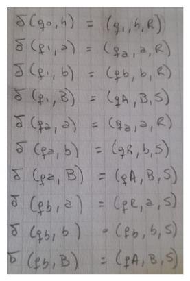
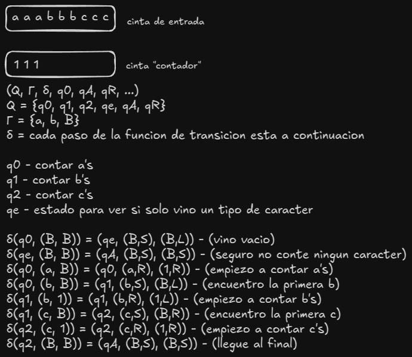
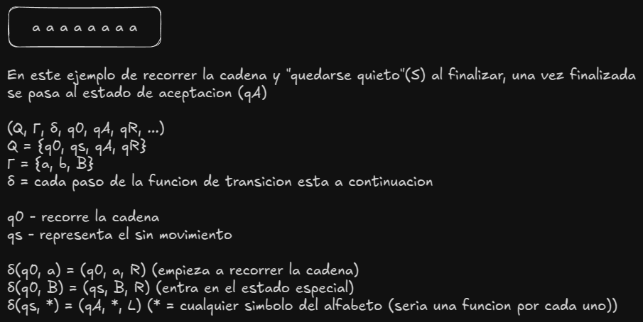
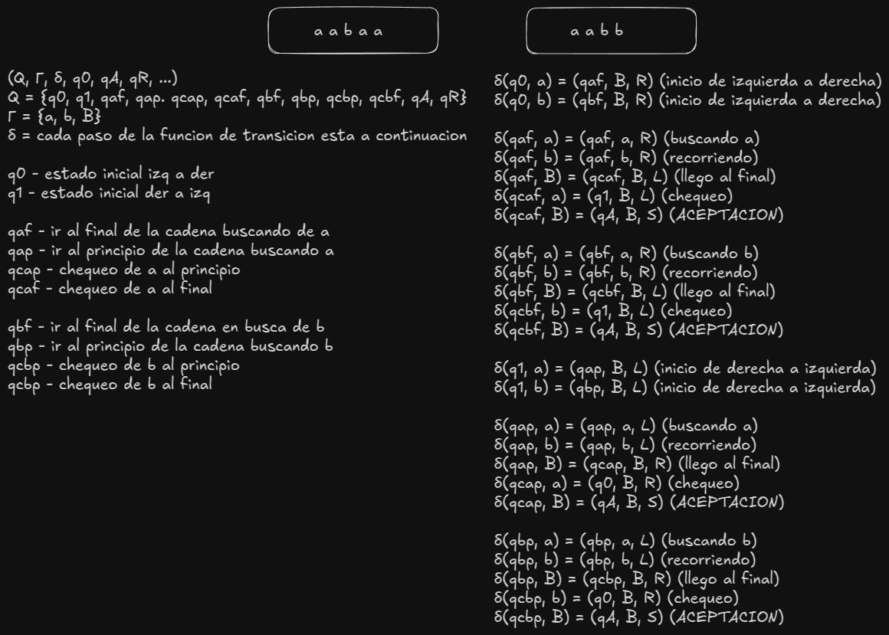
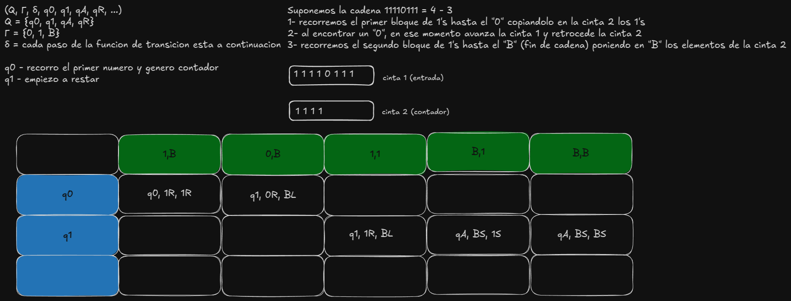
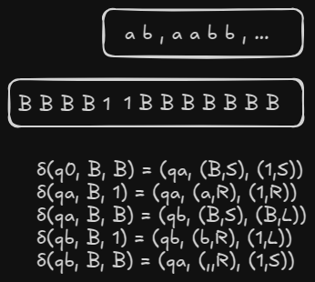

# Practica 1 Fundamentos de Teoria de la Computacion

## Ejercicio 1. Responder breve y claramente los siguientes incisos:

### 1. ¿En qué se diferencia un problema de búsqueda de un problema de decisión?  
Un <u>*problema de decisión*</u> es aquel cuya respuesta es "sí" o "no". Es decir, se trata de determinar si una entrada cumple con una condición determinada.  
Un <u>*problema de búsqueda*</u>, en cambio, requiere encontrar una solución específica cuando esta existe. No basta con responder "sí" o "no", sino que se debe proporcionar un ejemplo concreto de la solución.  
<u>**Ejemplo:**</u>   
*Problema de decisión: ¿Existe una asignación de valores de verdad que hace verdadera una fórmula booleana? SAT (satisfactibilidad booleana)*  
*Problema de búsqueda: Encontrar una asignación de valores de verdad que haga verdadera la fórmula.*
  
### 2. ¿Por qué en el caso de los problemas de decisión, podemos referirnos indistintamente a problemas y lenguajes?
Un problema de decisión es un conjunto de preguntas con respuesta "sí" o "no".  
Un lenguaje es un conjunto de cadenas sobre un alfabeto.  
¿Por qué podemos referirnos a problemas de decisión como lenguajes?  
Porque podemos representar cualquier problema de decisión como un conjunto de cadenas que representan los casos donde la respuesta es "sí".  
<u>**Ejemplo:**</u>  
*Problema de decisión:*  ¿Es satisfactible la fórmula φ?  
*Lenguaje asociado:*  Conjunto de todas las fórmulas satisfactibles.  
Matemáticamente, si definimos 𝐿 como el conjunto de todas las fórmulas que son satisfactibles, entonces podemos escribirlo como:  
*𝐿 = {𝜙∣𝜙 es una formula booleana satisfactible}*
Así, resolver el problema de decisión SAT es equivalente a preguntar si una fórmula 𝜙 pertenece al lenguaje 𝐿.  
<u>En general, cualquier problema de decisión puede expresarse como el lenguaje de las instancias que responden "sí".</u>
  
### 3. El problema de satisfactibilidad de las fórmulas booleanas, en su forma de decisión, es: “Dada una  fórmula  φ,  ¿existe  una  asignación  A  de valores de  verdad  que  la  hace  verdadera?”  
### Enunciar el problema de búsqueda asociado.  
El problema de búsqueda SAT es:  
**Dada una fórmula booleana φ, encontrar una asignación A de valores de verdad a sus variables que la haga verdadera, si tal asignación existe.**  
Si la fórmula no es satisfactible, el problema de búsqueda no tiene solución.  
*Problema de búsqueda: Encontrar una asignación de valores de verdad que haga verdadera la fórmula.*
  
### 4. Otra visión de MT es la que genera un lenguaje (visión generadora). En el caso del problema del  inciso  anterior,  ¿qué  lenguaje  generaría  la  MT  de  visión  generadora  que  resuelve  el problema?  
Ʃ = {a, b, ∨} simbolos que supongo tiene el alfabeto  
Ʃ* ={todas las convinaciones (infinitas) de los simbolos del alfabeto}  
L = {todas las convinaciones (infinitas) de los simbolos del alfabeto que resultan en una formula booleana satisfactibles}   
una maquina generadora, en este caso nos generaria infinitas combinaciones con el conjunto Ʃ, ya que no tenemos restricciones.

  
### 5. ¿Qué postula la Tesis de Church-Turing?   
La Tesis de Church-Turing dice que **todo problema resoluble mediante un algoritmo puede resolverse con una Máquina de Turing.**  
**Todo dispositivo computacional físicamente realizable puede ser simulado por una MT.**  
Se basa en el hecho de que **todos los modelos formales de computación conocidos son equivalentes a las Máquinas de Turing.**  
Define los límites de la computación, estableciendo que ciertos problemas simplemente no pueden resolverse algorítmicamente.  

<u>**Ejemplo de problemas computables:**</u>  
- Sumar dos números.
- Encontrar el camino más corto en un grafo.
- Determinar si una palabra pertenece a un lenguaje regular.  

<u>**Ejemplo de problemas NO computables:**</u>  
- Determinar si cualquier programa arbitrario se detendrá o se ejecutará para siempre (Problema de la Parada).
- Generar la lista completa de teoremas verdaderos en matemáticas (Problema de Entscheidungsproblem de Hilbert).
  
### 6. ¿Cuándo dos MT son equivalentes? ¿Y cuándo dos modelos de MT son equivalentes?  
<u>*Dos Máquinas de Turing son equivalentes si*</u> reconocen el mismo lenguaje o computan la misma función. Es decir, para toda entrada, producen la misma salida (ya sea aceptación/rechazo o un resultado computacional).  
<u>*Dos modelos de Máquinas de Turing son equivalentes si*</u> dada una MT de un modelo existe una MT equivalente del otro.  
<u>**Ejemplo:**</u>  
Cuando hablamos de modelos hablamos por ejemplo 1 MT de 1 cinta vs 1 MT de 2 cintas  
• Ejemplos de modelos de MT equivalentes al modelo de MT con una cinta: MT con varias cintas, MT con
cintas semi-infinitas (sólo infinitas a la derecha), MT con dos cintas y un solo estado, etc.
• Ejemplos de modelos computacionales equivalentes al modelo de las MT: máquinas RAM (acceso
directo), circuitos booleanos, lambda cálculo, funciones recursivas, gramáticas, programas C, etc.
  

## Ejercicio 2. Dado el alfabeto Ʃ = {0, 1}: 
### 1. Obtener el conjunto Ʃ* y el lenguaje incluido en Ʃ* con cadenas de a lo sumo 2 símbolos.   
Ʃ* = {λ, 0, 1, 01, 0011, 0001111, 0000011111, ...}  
L1 = {λ, 0, 1, 00, 01, 10, 11}  

### 2. Sea el lenguaje L = {0n1n | n ≥ 0}. Obtener los lenguajes Ʃ* ⋂ L, Ʃ* ⋃ L y LC respecto de Ʃ*.  
L = {λ, 01, 0011, 000111, 00001111, 0000011111, 000000111111, ...}  
Ʃ* ⋂ L = L  
Ʃ* ⋃ L = Ʃ*  
LC = {0, 1}  

## Ejercicio 3. En clase se mostró una MT no determinística (MTN) que acepta las cadenas de la forma han o hbn, con n ≥ 0. Construir (describir la función de transición) una MT  determinística (MTD) equivalente.  

 
## Ejercicio 4.  
### Describir la idea general de una MT con varias cintas que acepte, de la manera más eficiente posible (menor cantidad de pasos), el lenguaje
### L = {anbncn | n ≥ 0}.  

## Ejercicio  5.  
### Explicar  cómo  una  MT  sin  el  movimiento  S  (el  no  movimiento)  puede  simular (ejecutar) otra que sí lo tiene.  

## Ejercicio 6.  
### En clase se construyó una MT con 2 cintas que acepta L = {w | w ∈ {a, b}* y w es un palíndromo}.  Construir  una  MT  equivalente  con  1  cinta.  Ayuda:  la  solución  que  vimos  para aceptar el lenguaje de las cadenas anbn, con n ≥ 1, puede ser un buen punto de partida. 

### Ejercicio 7.  
### Construir una MT que calcule la resta de dos números. Ayuda: se puede considerar la idea de solución propuesta en clase. 

### Ejercicio 8.  
### Construir una MT que genere todas las cadenas de la forma anbn, con n ≥ 1. Ayuda: se puede considerar la idea de solución propuesta en clase. 
 
