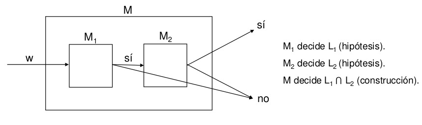
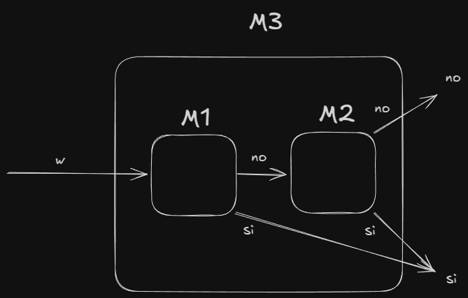
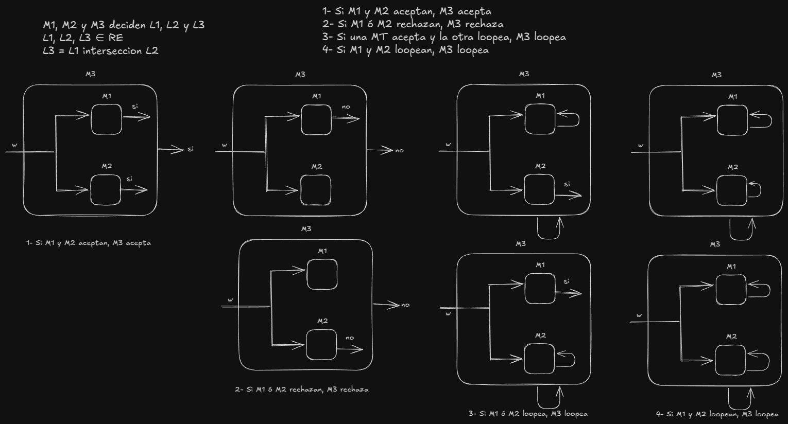

# Practica 2 Fundamentos de Teoria de la Computacion  
## Ejercicio 1. Responder breve y claramente los siguientes incisos:  
### 1. ¿En qué se diferencian los lenguajes recursivos, los lenguajes recursivamente numerables no recursivos y los lenguajes no recursivamente numerables?  
**Lenguajes recursivos (decidibles):**  
Son aquellos para los cuales existe una Máquina de Turing (MT) que, para cualquier cadena de entrada, siempre se detiene y decide (acepta o rechaza). 

**Lenguajes recursivamente numerables (RE) que no son recursivos (semi-decidibles):**  
Son lenguajes para los cuales existe una MT que acepta las cadenas del lenguaje, pero en caso de que la cadena no pertenezca al lenguaje, la MT puede entrar en un bucle infinito (no se garantiza la detención).

**Lenguajes no recursivamente numerables:**  
Son lenguajes para los cuales no existe ninguna MT que pueda, aun en forma semi-decidible, enumerar todas las cadenas del lenguaje. Es decir, ni siquiera se puede construir una máquina que, al menos, acepte las cadenas pertenecientes al lenguaje.

### 2. Probar que R ⊆ RE ⊆ 𝔏. Ayuda: usar las definiciones.  
**R ⊆ RE:**  
Si un lenguaje es recursivo, existe una MT que siempre se detiene decidiendo la pertenencia de cualquier cadena. Por lo tanto, tomando esa misma MT se tiene que, cuando la cadena pertenece al lenguaje, la máquina la acepta. Esto implica que todo lenguaje decidible es, a la vez, recursivamente numerable.

**RE ⊆ 𝔏:**  
Todo lenguaje recursivamente numerable es un subconjunto de Σ* (el conjunto de todas las cadenas sobre el alfabeto Σ). En otras palabras, son lenguajes (conjuntos de cadenas) y, por definición, todo lenguaje pertenece a la familia 𝔏 de lenguajes.

### 3. Dijimos en clase que el hecho de que si L es recursivo entonces LC también lo es, significa en  términos  de  problemas  que  si  un  problema  es  decidible  entonces  también  lo  es  el problema  contrario.  ¿Qué  significa  en  términos  de  problemas  que  la  intersección  de  dos lenguajes recursivos es también un lenguaje recursivo?  
Si tenemos una MT1 que resuelve un lenguaje L1, y una MT2 que resuelve un lenguaje L2 (L1 ^ L2 ∈ R), entonces existe una MT3 que resuelve un lenguaje L3 (L3 ∈ R) entonces vemos que L3 es la interseccion entre L1 ^ L2  
  

### 4. Explicar por qué no es correcta la siguiente prueba de que si L ∈ RE, también LC ∈ RE: dada una  MT  M  que  acepta  L,  entonces  la  MT  M’,  igual  que  M  pero  con  los  estados  finales permutados, acepta LC.  
**Problema del loop:**  
La máquina original M, que acepta L, garantiza que cuando una cadena w está en L se detendrá aceptándola; sin embargo, cuando la cadena w no pertenece a L, M puede no detenerse (entrar en un bucle infinito). Simplemente intercambiar los estados de aceptación y no aceptación no soluciona el problema de la detención, ya que M′ no tiene control sobre las computaciones infinitas de M.  

### 5. ¿Qué lenguajes de la clase CO-RE tienen MT que los aceptan? ¿También los deciden?  
**Definición de CO-RE:**  
Son aquellos lenguajes cuyo complemento es recursivamente numerable (L ∈ CO-RE ^ LC ∈ RE).

**Máquinas que los aceptan:**  
Para un lenguaje L ∈ CO-RE, existe una MT que semidecide su complemento LC. Esto implica que, aunque podamos construir una máquina que “acepte” L (o, más propiamente, que reconozca cuando una cadena no está en LC), dicha máquina en general no decide L porque podría no detenerse para cadenas fuera de L.

**Decisión:**  
Los lenguajes en CO-RE, en general, no son decidibles a menos que además pertenezcan a RE (en cuyo caso serían recursivos ya que RE ⋂ CO-RE ⊆ R). Por ello, en CO-RE podemos tener máquinas que aceptan (semi-decidibilidad) pero no necesariamente deciden el lenguaje.

### 6. Probar que el lenguaje Ʃ* de todas las cadenas y el lenguaje vacío ∅ son recursivos. Alcanza con plantear la idea general. Ayuda: encontrar MT que los decidan.
**Lenguaje Σ* (todas las cadenas):**  
Se puede construir una MT que, para cualquier entrada, simplemente acepte sin realizar ningún cómputo complejo. Esta máquina siempre se detiene aceptando, lo que demuestra que Σ* es recursivo.

**Lenguaje vacío (∅):**  
De manera similar, se puede diseñar una MT que, para cualquier entrada, rechace de forma inmediata. Dado que la máquina se detiene en todos los casos, ∅ es recursivo.

La idea central es definir máquinas de Turing “triviales” que no necesitan realizar cálculos complejos y siempre se detienen con una respuesta.

### 7. Probar que todo  lenguaje finito  es recursivo.  Alcanza  con  plantear la idea general.  Ayuda: encontrar una MT que lo decida (pensar cómo definir sus transiciones para cada una de las cadenas del lenguaje).  
En este caso necesitamos construir una MT que ante cualquier cadena de un lenguaje L que es finito, tenga una transicion que termine aceptando cualquier cadena definida en el lenguaje L.

## Ejercicio 2. Considerando la Propiedad 2 estudiada en clase: 
### 1. ¿Cómo implementaría la copia de la entrada w en la cinta 2 de la MT M?  
**Paso 1: Por cada posicion de la cinta 1 con un simbolo <> B:**  
- Copiar el simbolo encontrado en la cinta 1 a la cinta 2
- Mover ambos cabezales a la derecha

**Paso 2: UNa vez copiada toda la informacion, se pasa a estados adicionales que indican que MT deberia decidir w**

### 2. ¿Cómo implementaría el borrado del contenido de la cinta 2 de la MT M?  
**Paso 1: Posicionar el cabezal de la cinta 2 en el inicio.**  
**Paso 1: Por cada posicion en la cinta 2 con un simbolo <> B:**  
- Escribir el símbolo B en la cinta 2.
- Mover el cabezal de la cinta 2 a la derecha.  

**Paso 2: Una vez borrada toda la información, se puede reposicionar el cabezal en la posición inicial (usando estados adicionales) para continuar con la siguiente fase de la computación ya que .**  

## Ejercicio 3. Probar: 
### 1. La clase R es cerrada con respecto a la operación de unión. Ayuda: la prueba es similar a la desarrollada para la intersección.  
Si existe una MT M1 que decide un lenguaje L1, y existe una MT M2 que decide un lenguaje L2 (L1 ^ L2 ∈ R), entonces podemos construir una MT M3 que decide un lenguaje L3 (L3 = L1 ⋃ L2), es decir, **<u>M3 acepta si M1 ó M2 aceptan</u>**  
  

### 2. La clase RE es cerrada con respecto a la operación de intersección. Ayuda: la prueba es similar a la desarrollada para la clase R.  
Si existe una MT M1 que decide un lenguaje L1, y existe una MT M2 que decide un lenguaje L2 (L1 ^ L2 ∈ RE), entonces podemos construir una MT M3 que decide un lenguaje L3 (L3 = L1 ⋂ L2), es decir, **<u>M3 acepta si M1 y M2 aceptan</u>**

## Ejercicio  4.
### Sean  L1  y  L2  dos  lenguajes  recursivamente  numerables  de  números  naturales codificados en unario (por ejemplo, el número 5 se representa con 11111). Probar que también es recursivamente numerable el lenguaje L = {x | x es un número natural codificado en unario, y existen y, z, tales que y + z = x, con y ∈ L1, z ∈ L2}.  Ayuda: la prueba es similar a la vista en clase, de la clausura de la clase RE con respecto a la operación de concatenación.  

## Ejercicio 5. Dada una MT M1 con alfabeto Γ = {0, 1}: 
### 1. Construir una MT M2, utilizando la MT M1, que acepte, cualquiera sea su cadena de entrada, sii la MT M1 acepta al menos una cadena.  

### 2. ¿Se puede construir además una MT M3, utilizando la MT M1, que acepte, cualquiera sea su cadena de entrada, sii la MT M1 acepta a lo sumo una cadena? Justificar. Ayuda para la parte (1): si M1 acepta al menos una cadena, entonces existe al menos una cadena de símbolos 0 y 1, de tamaño n, tal que M1 la acepta en k pasos. Teniendo en cuenta esto, pensar cómo M2 podría simular M1 considerando todas las cadenas de símbolos 0 y 1 hasta encontrar eventualmente una que M1 acepte (¡cuidándose de los casos en que M1 entre en loop!).  
