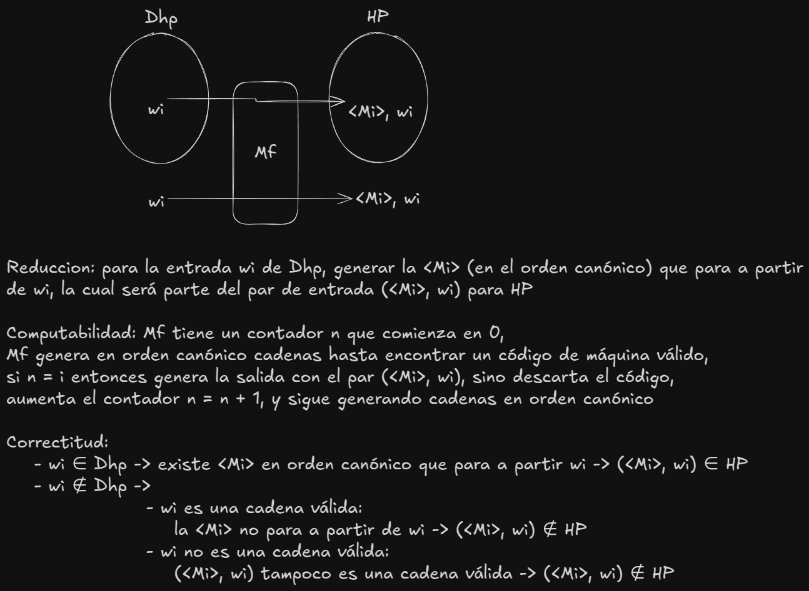
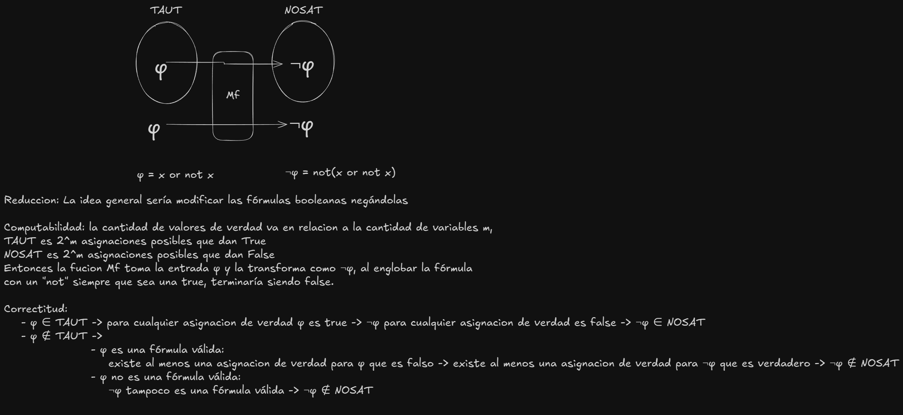
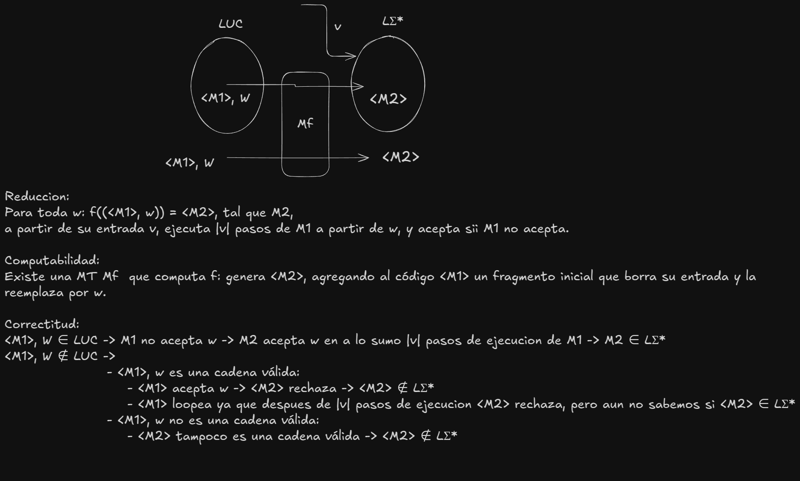

# Practica 4 Fundamentos de Teoria de la Computacion  

## Ejercicio 1. Considerando la reducción de HP a LU descripta en clase, responder: 
- **a.** Explicar por qué la función identidad, es decir la función que a toda cadena le asigna la misma cadena, no es una reducción de HP a LU.
  - La función de identidad no es una reduccion de HP a LU ya que ***tendriamos problemas con la correctitud***, porque teniendo una maquina HP que recibe una entrada ( < M1 >, w ) podriamos tener 2 casos donde ( < M1 >, w ) ∈ HP.
  - **caso 1**: ( < M1 >, w ) ∈ HP -> M1 acepta w y M2 acepta w ya que  ( < M2 >, w ) ∈ LU **aca no tenemos ningún problema (HP termina en QA y LU termina en QA)**
  - **caso 2**: ( < M1 >, w ) ∈ HP -> M1 rechaza w y M2 rechaza w ya que ( < M2 >, w ) ∉ LU
- **b.** Explicar por qué las MT M2 generadas en los pares de salida (< M2 >, w), o bien paran aceptando, o bien loopean. 
  - Al realizar los cambios de estados entre ( < M1 >, w ) y ( < M2 >, w ), nos queda que ( < M2 >, w ) solo podría aceptar o loopear
- **c.** Explicar por qué la función utilizada para reducir HP a LU también sirve para reducir HPC a LUC. 
  - Esto se cumple por la propiedad vista en clase: ***L1 <= L2 sii L1C <= L2C. La reducción es la misma***.
- **d.** Explicar por qué la función utilizada para reducir HP a LU no sirve para reducir LU a HP. 
  - No se cumple la simetría. ***L1 <= L2 no implica L2 <= L1***. 
- **e.** Explicar por qué la siguiente MT Mf no computa una reducción de HP a LU: dada una cadena válida (<M>, w), Mf ejecuta M sobre w, si M acepta entonces genera la salida (<M>, w), y si M rechaza entonces genera la cadena 1.  
  - Las funciones de reduccion que se dan en las MTf no pueden simular otras MT's sobre todo si no son decidibles ya que potencialmente la MT que simulemos dentro de MTf podría loopear y esto va en contra de los fundamentos de las funciones de reduccion (siempre deben parar).
  
## Ejercicio 2. Sabiendo que LU ∈ RE y LUC ∈ CO-RE: 
- **a.** Probamos en clase que existe  una reducción de LU a LƩ*.  En base a esto,  ¿qué se puede afirmar con respecto a la ubicación de LƩ* en la jerarquía de la computabilidad?  
  - Sabemos que existe una reduccion de LU <= LƩ*, esto nos dice que LƩ* es igual o más complejo que LU
  - Como LU ∈ RE y LƩ* es igual o mas complejo, entonces deducimos que LƩ* ∉ R, porque R es menos complejo que RE **LƩ* ∉ R**
  - Sabemos que existe una reduccion de LUC <= LƩ*, esto nos dice que LƩ* es igual o más complejo que LUC
  - Como LUC ∈ CO-RE y LƩ* es igual o mas comlejo, entonces deducimos que LƩ* ∉ RE, porque RE es menos complejo que CO-RE **LƩ* ∉ RE**
  - si LU <= LƩ* y sabemos por propiedad del complemento que entonces LUC <= LƩ*C, sabiendo que LUC ∈ CO-RE entonces podriamos pensar que LƩ*C ∈ CO-RE, pero ya demostramos que LƩ* ∉ RE, sabienDO que para que un lenguaje L ∈ CO-RE, LC ∈ RE, entonces no puede pasar que LƩ* y LƩ*C ∈ CO-RE.
  - Tanto LƩ* y LƩ*C ∈ L - (RE ⋃ CO-RE)
- **b.** Se prueba que existe una reducción de LUC a L∅. En base a esto, ¿qué se puede afirmar con respecto a la ubicación de L∅ en la jerarquía de la computabilidad? 
  - Sabemos que existe una rediccion de LUC a L∅, esto nos dice que L∅ es igual o mas complejo que LUC
  - Como LUC ∈ CO-RE y L∅ es igual o mas complejo, entonces deducimos que L∅ ∉ RE ya que RE es menos complejo que CO-RE ***(por lo tanto ∉ R)***
  - Por construccion sabemos que podemos tener una MT que acepte AL MENOS UNA CADENA (L∅C), como puedo construir esa maquina demuestro qeu L∅C ∈ RE
  - Por propiedad sabemos que si L1 ∈ RE -> L1C ∈ CO-RE, entonces si L∅C ∈ RE entonces L∅ ∈ CO-RE
 
## Ejercicio  3.  Sea el lenguaje DHP  = {wi  | Mi  para  a partir de  wi} (considerar  el orden  canónico). Encontrar  una  reducción  de  DHP  a  HP.  Comentario:  hay  que  definir  la  función  de  reducción  y probar su total computabilidad y correctitud.  
 
 
## Ejercicio 4. Sean TAUT y NOSAT los lenguajes de las fórmulas booleanas sin cuantificadores tautológicas  (satisfactibles  por  todas  las  asignaciones  de  valores  de  verdad)  e  insatisfactibles (insatisfactibles por todas las asignaciones de valores de verdad). Encontrar una reducción de TAUT  a  NOSAT.  Comentario:  hay  que  definir  la  función  de  reducción  y  probar  su  total computabilidad y correctitud.  

 
## Ejercicio 5. Se prueba que existe una reducción de LUC a LƩ* (y así, como LUC ∉ RE, entonces se cumple que LƩ* ∉ RE). La reducción es la siguiente. Para toda w: f((< M1 >, w)) = < M2 >, tal que M2, a partir de su entrada v, ejecuta |v| pasos de M1 a partir de w, y acepta sii M1 no acepta. Probar que la función definida es efectivamente una reducción de LUC a LƩ*. Comentario: hay que probar su total computabilidad y correctitud.  
