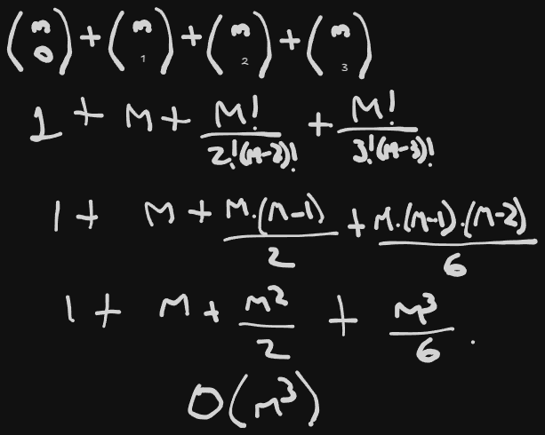
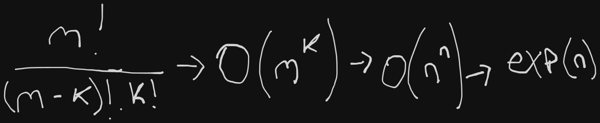

# Practica 5 Fundamentos de Teoria de la Computacion
## Ejercicio 1. Responder breve y claramente los siguientes incisos:  
### a.  ¿Por qué la complejidad temporal sólo trata los lenguajes recursivos? 
Se tratan los problemas **Recursivos (decidibles)** ya que de esa manera tiene sentido medir la complejidad  **temporal y espacial** porque sabemos que son problemas tratados con MT'S que siempre se detienen, en el caso de los problemas **Recursivos Enumerables (semi-decidibles)** no tendría sentido realizar estas mediciones ya que los problemas que pertenecen a los lenguajes **RE** pueden nunca detenerse.
### b.  Probar que n^3 = O(2^n). Ayuda: hay que encontrar un número natural n0 y una constante c > 0 tales que n3 <= c.2^n para todo n >= n0. 
3^3 = 2^3 -> 9 = 1*8 (con un n0=3 no se cumple que n^3 <= c.2^n)

10^3 = 2^10 -> 1000 = 1*1024 (con un n0=10 siempre n^3 <= c.2^n)

### c.  Probar que si T1(n) = O(T2(n)), entonces TIME(T1(n)) ⊆ TIME(T2(n)). Ayuda: hay que probar que si un lenguaje L está en TIME(T1(n)), también está en TIME(T2(n)) - recurrir directamente a la definición de orden O de una función T y de clase TIME(T(n)) -.   
T1(n) = 5.n ----- O(n)
T2(n) = 5^n ----- O(2^n)
T1(n) = O(T2(n))
TIME(T1(n)) ⊆ TIME(T2(n)) ya que la "clase" TIME(T2(n)) contiene los lenguajes que se deciden en tiempo <= a O(T2(n))

### d.  ¿Cuándo un lenguaje pertenece a P, a NP y a EXP? ¿Por qué si un lenguaje pertenece a P también pertenece a NP y a EXP? 
- **P:** Todo lenguaje L de P cuenta con una MT M que en poly(|w|) pasos puede decidir si w ∈ L.
- **NP:** Todo lenguaje L de NP cuenta con una MT M que en poly(|w|) pasos puede verificar si w ∈ L, **con la ayuda de otra cadena (certificado x)**. **<u>|x| <= poly(|w|) Se dice que x es un certificado sucinto</u>**
- **EXP:** Lenguajes decidibles en tiempo exp(n)

**<u>Por deducción entonces podemos ver que P ⊂ NP ⊂ EXP ya que:</u>**
- Si puedo decidir un lenguaje en P, seguro puedo decidirlo en NP
- Si puedo decidir un lenguaje en NP, seguro puedo decidirlo en EXP

### e.  ¿Qué formula la Tesis Fuerte de Church-Turing? 
**<u>Tesis Fuerte de Church-Turing</u>**
Si  L  es  decidible  en  tiempo  poly(n)  por  un  modelo  computacional  físicamente  realizable, también  es  decidible 
en tiempo poly(n) por una MT **(al menos hasta que las máquinas cuánticas sean una realidad).**

### f. ¿Por qué es indistinta la cantidad de cintas de las MT que utilizamos para analizar los lenguajes, en el marco de la jerarquía temporal que definimos? 
**si una MT M1 con K1 cintas tarda tiempo poly(n), existe una MT M2 equivalentecon K2 cintas que también tarda tiempo poly(n).**  
pueden cambiar la cantidad de pasos, configuraciones, etc, pero eso **no modifica el orden**

### g.  ¿Qué codificación de cadenas se descarta en la complejidad temporal? 
Todo símbolo se codifica con un número. Se utiliza cualquier codificación distinta de la unaria **(codificar números grandes en unario no es físicamente realizable, y además genera inconsistencias).**

### h.  ¿Por qué si un lenguaje L pertenece a P, también su complemento LC pertenece a P? 
**Ayuda: hay que probar que si existe una MT M que decide L en tiempo poly(n), también existe una MT M' que decide LC en tiempo poly(n).**   
Si podemos construir una maquina MT M1 que decide el lenguaje L en tiempo polinomial, seguro podemos **construir una MT M2, que simula M1 e intercambia los estados**, de esa manera decidimos en a lo sumo un paso extra LC respecto a L (lo cual no modifica el orden) y demostramos que también pertenece a P ya qeu se resuelve en tiempo polinomial.

### i. Sea L un lenguaje de NP. Explicar por qué los certificados de L miden un tamaño polinomial con respecto al tamaño de las cadenas de entrada.
Como L es un lenugaje de la clase NP, sabemos que se decide en tiempo **exp(n)**, entonces necesitamos que el certificado **x** sea de tamaño polinomial (tamaño = |x|), de esta manera sabemos que para "leer" el certificado no gastamos mas que tiempo polinomial.
 
## Ejercicio 2. Sea el lenguaje SMALL-SAT = {φ | φ es una fórmula booleana sin cuantificadores en  la  forma  normal conjuntiva  (o FNC), y existe una asignación de valores de verdad que la satisface en la que hay a lo sumo 3 variables con valor de verdad verdadero}. Probar que SMALL-SAT ∈ P. 
**Comentario: las fórmulas φ en la forma FNC son conjunciones de disyunciones de variables o variables negadas;ej. (x1 OR x2) ^ x4 ^ (¬x3 OR x5 OR x6). Ayuda:  una  MT  que  decide  SMALL-SAT  debe  contemplar  asignaciones  con  cero,  uno,  dos  y hasta tres valores de verdad verdadero.**  
Si tenemos `m` variables en nuestra fórmula, y necesitamos contemplar los subconjuntos de las mismas que tengan `0, 1, 2, 3` valores de verdad en verdadero, entonces utilizamos combinatoria.  
**En este caso tendríamos la siguiente cantidad de asignaciones:**  
   
**Teniendo entonces m^3 asignaciones, podemos ver que tenemos además la evaluación de cada asignación O(|φ|^2)**  
**O(m^3 . |φ|^2) ---> O(n^3 . n^2) ---> poly(n)**

 
## Ejercicio  3.  Dados  los  dos  lenguajes  siguientes,  (1)  justificar  por  qué  no  estarían  en  P,  (2) probar que están en NP, (3) justificar por qué sus complementos no estarían en NP: 

### a.  El  problema  del  conjunto  dominante  de  un  grafo  consiste  en  determinar  si  un  grafo  no dirigido tiene un conjunto dominante de vértices. Un subconjunto D de vértices de un grafo G  es  un  conjunto  dominante  de  G,  sii  todo  vértice  de  G  fuera  de  D  es  adyacente  a  algún vértice de D. El lenguaje que representa el problema es DOM-SET = {(G, K) | G es un grafo no dirigido y tiene un conjunto dominante de K vértices}.  
1) **justificación de por qué no estaría en `P`**  
     
2) **justifiación de por qué está en `NP`**  
   se puede verificar en tiempo poly(n) si un conjunto C de K vértices define un conjunto dominante de tamaño K de un grafo G, se recorren 2 veces todos los vertices para ubicar primero los vertices externos al conjunto dominante, por cada uno de estos verifico si estan conectados a un vertice interno del conjunto dominante, y por cada una de estas comparaciones vamos recorriendo la "lista" de aristas. Siempre contemplamos el peor caso donde se recorren todos los vertices como asi tambien todas las aristas en cada comparacion. 
   `O(|K|^2.|E|) = O(|V|^2.|E|) = O(|G|^3) = O(n3) = poly(n)`  
3) **justificación de por qué el complemento de `DOM-SET-C` no estaría en `NP`**  
   `DOM-SET-C = {(G, K) | G es un grafo que no tiene un conjunto dominante de tamaño K}`  
   si para demostrar que esta en `NP` buscamos un certificado sucinto, para demostrar que no estaría en `NP` entonces basta con  demostrar tendríamos un certificado de tamaño `exp(n)`, en este caso podemos ver que para encontrar que en un grafo `G` <u>NO EXISTEN CONJUNTOS DOMINANTES</u> deberíamos en su certificado todos los subconjuntos de grafos presentes en `G`, y como vimos, esto tendría un tamaño `exp(n)`.
   
### b.  El  problema  de  los  grafos  isomorfos  consiste  en  determinar  si  dos  grafos  son  isomorfos. Dos  grafos  son  isomorfos  si  son  idénticos  salvo  por  la  denominación  de  sus  arcos.  P.ej., dado el grafo G1 = ({1, 2, 3, 4}, {(1, 2), (2, 3), (3, 4), (4, 1)}), el grafo G2 = ({1, 2, 3, 4}, {(1, 2), (2, 4), (4, 3). (3, 1)}) es isomorfo a G1. El lenguaje que representa el problema de los grafos isomorfos es ISO = {(G1, G2) | G1 y G2 son grafos isomorfos}.  
1) **justificación de por qué no estaría en `P`**  
   Podemos decir que `ISO` no estaría en `P` ya que para decidir este problema deberíamos permutar los vértices de uno de los grafos (como consecuencia se modifican las aristas), y luego de esto deberíamos comparar entre las aristas de `G1` y `G2`.  
   Entonces `ISO` se decide en `O(|V|! . |E|^2) -> O(n!) -> exp(n)`, ya que permutaríamos los `n` vértices  
   **exp(n) <= n!**
2) **justificación de por qué está en `NP`**  
   Recibiría un certificado del tipo `(G1, G2, {1, 2, 4, 3})`, entonces se recorrerían todos los vertices, y por cada uno de los vertices se recorrería la lista de aristas para modificarlas y comparar con la lista del otro grafo.
   Entonces el certificado `(G1, G2, {1, 2, 4, 3})` se decide en `O(|E|^2) -> O(n^2) -> poly(n^2)` 
3) **justificación de por qué el complemento de `ISO-C` no estaría en `NP`**  
   `ISO-C = {(G1, G2) | G1 y G2 no son grafos isomorfos}`
   Para demostrar que esta en `NP` deberíamos encontrar un certificado sucinto, en ese caso para verificar que <u>NO SON ISOMORFOS</u> deberíamos verificar un certificado con todas las posibles permutaciones de vértices que como vimos, serian `n!` permutaciones y por lo tanto `exp(n)`

 
## Ejercicio 4.  Se prueba que NP ⊆ EXP.
### La prueba es la siguiente.  Si L ∈ NP, entonces existe una  MT M que, para toda cadena de entrada w, verifica en tiempo poly(|w|) si w ∈ L, con la ayuda de un certificado x tal que |x| <= p(|w|) - p es un polinomio -, y de esta manera, se puede construir una MT M' que decida en tiempo exp(|w|) si w ∈ L, sin usar ninguna cadena adicional: M' simplemente barre todos y cada uno de los certificados posibles x de w. Se pide explicar por qué M' efectivamente tarda tiempo exp(|w|). Ayuda: como |x| <= p(|w|) y los símbolos de x pertenecen a un alfabeto de k símbolos, ¿cuántos certificados x de tamaño p(|w|) tiene a lo sumo una cadena w?   
- 1 certificado <= poly(|w|) ---> **un certificado tiene como máximo una longitud poly(|w|)**
- tenemos **k símbolos**, entonces **podríamos generar k^poly(|w|) certificados**, ya que generariamos permutaciones en funcion de k (cantidad de simbolos) y en este caso, **cualquier constante elevada a una función polinomial es exponencial**
- **si bien el tiempo de verificacion de cada certificado es poly(|w|), el total de certificados es de O(k^poly(|w|)), entonces si L ∈ NP entonces existe una M' que lo decide en tiempo exp()**