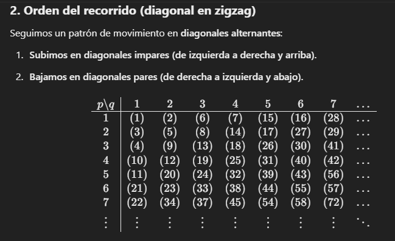
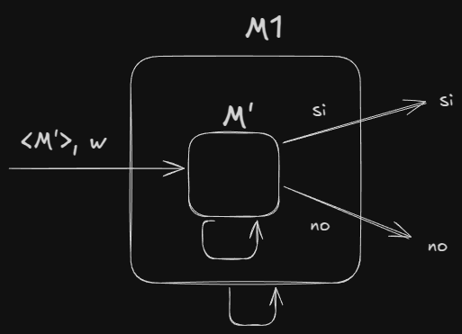

# Practica 3 Fundamentos de Teoria de la Computacion  
## Ejercicio 1. ¿Qué es una MT universal?  
Es  una  máquina  de  Turing  capaz  de  ejecutar  cualquier  otra noción de programa almacenado (otra máquina de Turing), La MT U recibe como entrada una MT M (codificada mediante 
una cadena <M>) y una cadena w, y ejecuta M a partir de w. 
**Ejemplo de codificacion de la MT M que recibe la MT U en su entrada** *ver diapositivas para entender el ejemplo de lo que representa*  
(< M >, w) = (1,2,1,3,2),(1,3,1,2,2),(1,1,2,1,3)#2,3
## Ejercicio  2. Explicar cómo enumeraría:
- **los números naturales pares**
  - paso 1: empiezo con n = 0
  - paso 2: imprimo n
  - paso 3: luego de imprimir aumento n = n + 2
  - vuelvo al paso 2
  
- **los números enteros**
  - paso 1: empiezo con n = 0
  - paso 2: imprimo n
  - paso 3: aumento n = n + 1
  - paso 4: imprimo n
  - paso 5: multiplico n * -1
  - paso 6: imprimo n
  - paso 7: multiplico n * -1
  - vuelvo al paso 3

- **los números racionales (o fraccionarios)**
  - primero imprimo 0
  - en la cinta representamos P y Q de manera unaria con los separadores correspondientes (p/q -> 111#11 -> 3/2)
  - la MT deberá moverse siguiendo un patrón diagonal
    - patrón diagonal:
      - Si estamos en una diagonal impar, incrementamos q y decrementamos p.
      - Si estamos en una diagonal par, incrementamos p y decrementamos q.
      - Si llegamos al borde de la tabla (p=0 o q=0), avanzamos a la siguiente diagonal. EL que llegó a 0 le sumamos 1 para estar nuevamente en la tabla
  - Eliminar fracciones repetidas:
    - La máquina debe calcular si gcd(p,q)=1. Si gcd⁡≠1, la borra y avanza a la siguiente. (maximo comun divisor)  

  - **EJEMPLO DEL RECORRIDO DIAGONAL**  
  -   
  

- **las cadenas de Ʃ* siendo Ʃ = {0, 1}**
  - paso 1: imprimo la cadena vacia
  - paso 2: empiezo con n = 1
  - paso 3: imprimo todas las cadenas de longitud n en orden ascendente
  - paso 4: incremento n en 1
  - vuelvo al paso 3

 
## Ejercicio 3. Dar la idea general de cómo sería una MT que, teniendo como cadena de entrada un número natural i, genera la i-ésima fórmula booleana satisfactible según el orden canónico.  
**Comentario: asumir que existen una MT M1 que determina si una cadena es una fórmula booleana, y una MT M2 que determina si una fórmula booleana es satisfactible.**   
La idea general es construir una MT M que a partir de la entrada del numero natural i:  
- paso 0: empieza con n = 0 (longitud de cadenas) y s = 0 (formula booleana satisfactible encontrada)  
- paso 1: genera una cadena en orden canónico de longitud n  
- paso 2: se ejecuta M1 sobre la cadena generada para saber si es una formula booleana  
- paso 3: si la cadena generada era una formula booleana, se ejecuta M2 sobre la cadena para saber si es satisfactible, sino voy al paso 6
- paso 4: si la cadena generada es una formula booleana satisfactible M incrementa s = s + 1, sino voy al paso 6
- paso 5: si s = i M acepta  
- paso 6: si no existen mas cadenas de longitud n -> n = n + 1  
- vuelvo al paso 1  
 
## Ejercicio 4. Sea M1 una MT que genera en su cinta de salida todas las cadenas de un lenguaje L. Dar la idea general de cómo sería una MT M2 que, usando M1, acepte una cadena w sii w ∈ L.  
Idea general, la MT M2 debería:
- aceptar w si w ∈ L
- rechazar si w ∉ L

Entonces:
- M2 ejecuta M1 para obtener una cadena w ∈ L
- M2 **<u>SIEMPRE ACEPTA</u>** ya que todas las cadenas que genere M1 son cadenas w ∈ L

 
## Ejercicio  5. El lenguaje LU = {(<M>, w) | M  acepta  w} se conoce como lenguaje universal, y representa el problema general de aceptación. Probar que LU ∈ RE. Ayuda: construir una MT que acepte LU. 
Para construir una MT M1 que acepte LU, lo que hacemos es ver que M1 ejecute w sobre el código que representa a M y:
- si M acepta w -> M1 acepta
- si M rechaza w -> M1 rechaza
- si M loopea -> M1 loopea

 
## Ejercicio 6. Una función f : A ⟶ B es total computable sii existe una MT Mf que la computa para todo elemento a ∈ A. Sea la función f01 : Ʃ* ⟶ {0, 1} tal que: 
**f01(v) = 1, si v = (< M >, w) y M para a partir de w.**  
**f01(v) = 0, si v = (< M >, w) y M no para a partir de w o bien v ≠ (< M >, w).**  
**Probar que f01 no es total computable (es recursivo). Ayuda: ¿con qué problema se relaciona dicha función?**  
Este problema se relaciona directamente con el HP. Para demostrar que no es total computable (recursivo - siempre se detiene) vamos a suponer que justamente es total computable para llegar a un absurdo.
Como sabemos que el HP (problema de la parada) es indecidible, para esto deberiamos construir una maquina que decida el HP, por lo tanto f01 no es total computable.
 
## Ejercicio  7. Responder breve y claramente cada uno de los siguientes  incisos (en todos los casos, las MT mencionadas tienen una sola cinta):  
## formula general del calculo `Total: N = K.N1.N2^K configuraciones distintas` `k=celdas` `n1=estados` `n2=simbolos`
### a. Probar que se puede decidir si una MT M, a partir de la cadena vacía λ, escribe alguna vez un símbolo no blanco. Ayuda: ¿Cuántos pasos puede hacer M antes de entrar en un loop?  
N = K.N1.N2^K  
K celdas, a 1 que es la cantidad de simbolos que queremos decidir si se escriben  
N1 estados, sabemos que son finitos, pero no cuantos en total  
N2 simbolos, no conocemos cuantos son en total  

N = estados * simbolos  

### b. Probar que se puede decidir si una MT M que sólo se mueve a la derecha,  a partir de una cadena w, para, Ayuda: ¿Cuántos pasos puede hacer M antes de entrar en un loop?  
N = K.N1.N2^K  
K celdas, en este caso es la longitud+1 de la cadena w (para verificar el B siguiente a la cadena)  
N1 estados, sabemos que son finitos, pero no cuantos en total  
N2 simbolos, no conocemos cuantos son en total  

N = (len(w)+1).N1.N2^(len(w)+1)  

### c. Probar que se puede decidir si dada una MT M, existe una cadena w a partir de la cual M para en a lo sumo 10 pasos. Ayuda: ¿Hasta qué tamaño de cadenas hay que chequear?  

### d. ¿Se puede decidir si dada una MT M, existe una cadena w de a lo sumo 10 símbolos a partir de la cual M para? Justificar la respuesta. 
